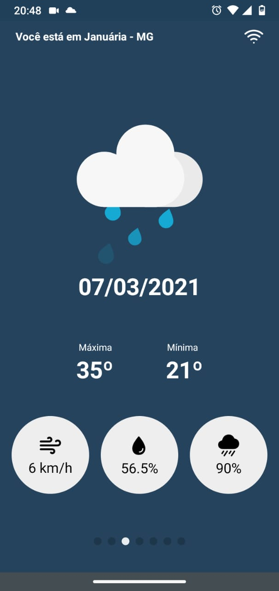
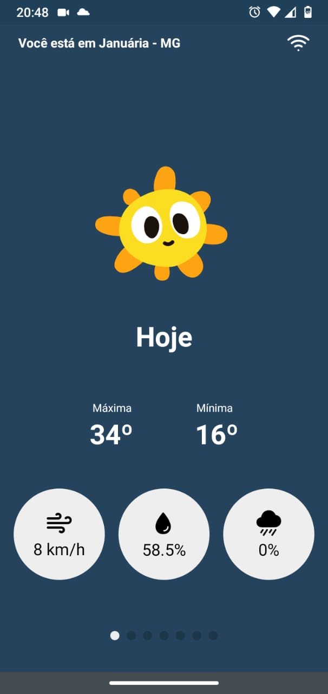

<!-- PROJECT LOGO -->
<br />
<p align="center">
  <a href="#">
    
  </a>

  <h3 align="center">React Native Clima Tempo</h3>
</p>


<!-- TABLE OF CONTENTS -->
<details open="open">
  <summary>Sumário</summary>
  <ol>
    <li>
      <a href="#getting-started">Getting Started</a>
      <ul>
        <li><a href="#prerequisites">Prerequisites</a></li>
        <li><a href="#installation">Installation</a></li>
      </ul>
    </li>
  </ol>
</details>


<!-- GETTING STARTED -->
## Getting Started
Esse projeto foi realizado utilizando: React Native CLI, Yarn, StyledComponents, Api Clima Tempo, Axios, ESLINT, Editor Config, Prettier.

Para usar o app, após passos de instalação descritos a seguir, basta abrir o app usando internet no primeiro acesso e depois o app listará 7 dias mesmo que não haja internet.

### Prerequisites

Para começar a utilizar é necessário ter o Node instalado e também o React Native, além disso variáveis globais podem ser informadas no arquivo .env. Também é necessário instalar o Yarn:
* npm
  ```sh
  npm install --global yarn
  ```

### Installation

1. Clone o repositório
   ```sh
   git clone https://github.com/marcoalvesalmeida/react-native-clima-tempo.git
   ```
2. Instale os pacotes na pasta raiz do seu projeto:
   ```sh
   yarn
   ```
3. Se necessário modificar, preencha as informações de ambiente no arquivo `.env`
   ```JS
   KEY_EXAMPLE=EXAMPLE;
   ``
4. Rode o comando para o servidor:
```sh
yarn start
```
5. Execute em seu dispositivo (Android):
```sh
   yarn android
   ```

6. Execute em seu dispositivo (IOS):
```sh
   cd ios
   pod install
   cd ..
   yarn ios
   ```
<p align="center">
    
    
</p>
